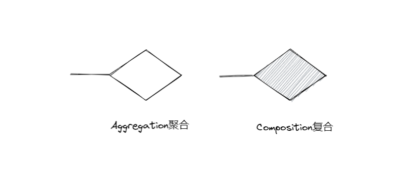

## 前言

聚合与复合都是 “**has**” 关系（区别继承is关系） (包含/所属关系)

###### **推荐使用聚合**！！

### 区别

MyESP32DevBoard has a OLED；

两者生命周期不同：

聚合关系下，使用**OLED *oled；**创建成员变量,`myESP32DevBoard01`销毁时，`oled01`依旧可用。（不相依为命）

复合关系下,使用**OLED oled；**创建成员变量 `myESP32DevBoard01`销毁时, `oled01`随同销毁。（相依为命）

在画UML图时，两者的符合也有区别：



 两种方式创建数据成员的不同

2.1 普通变量方式 --- 适合于复合关系（直接oled 对象） 

```c++
OLED oled; 
```

2.2 指针变量方式--- 适合于聚合关系（需要的时候才存入oled对象，不需要的时候赋值为nullptr释放）

```c++
OLED *oled; 
```

总结：**指针变量方式更灵活，推荐使用指针方式实现聚合关系。**

## 聚合 Aggregation - 相聚

**以指针方式，类中实例化另一个类，得到一个成员变量**


 MyESP32DevBoard has a OLED（排针排母插上的）；

创建

```c++
class OLED
{
    public:
    int width;
    int height;
    
    /* 默认构造 */
    OLED(){
        width = 320;
        height = 240;
    }
    /* 重载构造 */
    OLED(int w_p, int h_p){
        this.width = w_p;
        this.height = h_p;
    }
    
    int pixel()
    {
        return width * height;
    }
}


class MyESP32DevBoard
{
    public:
        int pin;
        OLED* oled;  /* 指针实现聚合 */
    
        /* 默认构造 */
        MyESP32DevBoard(){
            pin = 48;
            oled = nullptr;
        }
        /* 重载构造 */
        MyESP32DevBoard(int pin_p, OLED* oled_p = nullptr){
            pin = pin_p;
            oled = oled_p;
        }
}
```

使用

```c++
void setup()
{

    /* ---------- 生产一个带oled的myESP32DevBoard ---------- */
    
    /*
    OLED oled01(128, 128); //使用重载构造，生产一个独立的oled01
    MyESP32DevBoard myESP32DevBoard01;//使用默认构造，生产一个独立的myESP32DevBoard01
    myESP32DevBoard01.oled = &oled01; //将oled01装配到myESP32DevBoard01上
    */
    
    OLED oled01(128, 128); //使用重载构造，生产一个独立的oled01
     MyESP32DevBoard myESP32DevBoard01(32, &oled01); //使用重载构造直接创建并装配
    
    /* ---------- 使用myESP32DevBoard ----------*/
    Serial.println(myESP32DevBoard01.pin); 
    Serial.println(myESP32DevBoard01.oled -> pixel()); //访问聚合类
   
}
```


## 复合 Aggregation - 相依

**以普通变量方式，类中实例化另一个类，得到一个成员变量**

 MyESP32DevBoard has a OLED(焊死的)；

创建

```c++
class OLED
{
    public:
    int width;
    int height;
    
    /* 默认构造 */
    OLED(){
        width = 320;
        height = 240;
    }
    /* 重载构造 */
    OLED(int w_p, int h_p){
        this.width = w_p;
        this.height = h_p;
    }
    
    int pixel()
    {
        return width * height;
    }
}


class MyESP32DevBoard
{
    public:
        int pin;
        OLED  oled01;  /* 直接普通变量实现复合 */
    
        /* 默认构造 */
        MyESP32DevBoard(){
            pin = 48;
            oled = nullptr;
        }
        /* 重载构造 */
        MyESP32DevBoard(int pin_p){
            pin = pin_p;
        }
}
```

使用

```c++
void setup()
{

    /* ---------- 生产一个带oled的myESP32DevBoard ---------- */
     MyESP32DevBoard myESP32DevBoard01(32); //使用重载构造直接创建并装配
    myESP32DevBoard01.oled01.width = 128;
    myESP32DevBoard01.oled01.height = 128;
    
    /* ---------- 使用myESP32DevBoard ----------*/
    Serial.println(myESP32DevBoard01.oled01.pin); 
    Serial.println(myESP32DevBoard01.oled01.pixel()); //访问聚合类
   
}
```

总结：**推荐使用聚合**！！，更灵活。


