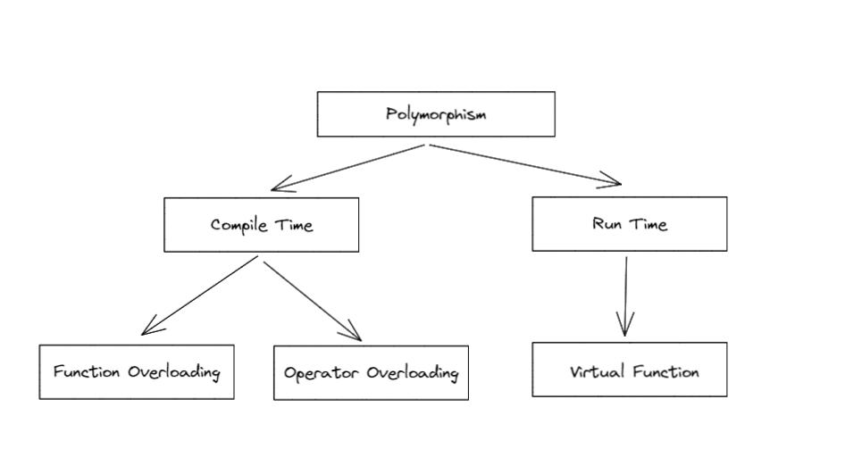

## 多态 Polymorphism

1. **多态**的两种出现形式，分别为**编译时**（静态绑定static binding）和**运行时**(动态绑定dynamic binding)。

**编译时**的多态，又分为**函数重载多态**（函数名相同参数不同实现函数多态）和**运算重载**（比如：+ 在不同场合具有不同作用）。在**运行时**的多态，只有一种情况，那就是**虚函数**。



## Compile Time - static binding - overload

1. Function Overloading 相同函数名不同参数

   ```c++
   void test()
   {
       
   }
   void test(int a)
   {
       
   }
   void test(int a, int b)
   {
       
   }
   void test(bool isOK)
   {
       
   }
   ```

类的构造函数的重载，其实也是Function Overloading。


2. Operator Overloading

   ```c++
   int a = 1 + 2； // 3 加法运算作
   String m = "1" + "2"; // “12” 组合作用
   ```

   

## Run Time - dynamic binding -override

1. Virtual Function

   虚函数的作用主要是实现了多态的机制。核心理念就是**通过基类访问派生类定义的函数**。

   所谓动态绑定，就是在运行时，**虚函数会根据绑定对象的实际类型，选择调用函数的版本。**

   **前提条件：对应类是继承关系，指针或引用方式创建对象**

   ```c++
   class ESP32
   {
       public:
          virtual void test(); 
   }
   
   class ESP32_PICO_D4 : public ESP32
   {
       public:
           virtual void test();
   }
   
   class ESP32_C3 : public ESP32
   {
       public:
           virtual void test();
   }
   
   void esp32Test(ESP32 &esp32_p)
   {
       esp32_p.test();
   }
   
   ESP32  esp32;
   ESP32_PICO_D4  esp32_pico_d4;
   ESP32_C3  esp32_c3;
   
    //动态绑定，能执行对应的的test()
   esp32Test(*esp32); 
   esp32Test(*esp32_pico_d4);
   esp32Test(*esp32_c3); 
   ```


不使用虚函数：

```c++
class ESP32
{
    public:
        void test(); 
}

class ESP32_PICO_D4 : public ESP32
{
    public:
         void test();
}

class ESP32_C3 : public ESP32
{
    public:
         void test();
}

void esp32Test(ESP32 &esp32_p)//&esp32_为引用
{
    esp32_p.test();
}

ESP32  esp32;
ESP32_PICO_D4  esp32_pico_d4;
ESP32_C3  esp32_c3;

 //静态绑定，全部执行父类ESP32的test()
esp32Test(*esp32); 
esp32Test(*esp32_pico_d4);
esp32Test(*esp32_c3); 
```


virtual可以继承给子类，故可以直接只虚化父类的函数。但是建议全部都写上，防止混乱。


## overload重载 override覆盖 redefine重定义

1. 三者区别

- 1. **同名函数不同参数**或**操作符重载**都属于**overload**。
- 2. **virtual**虚函数方式属于**override**
- 3. **默认**不使用virtual虚函数，但**定义了多个同名函数**，为**redefine**。（不推荐使用）

2. 多态的三种修饰词

   virtual，override ,final

   **override 子类强制覆盖，防止父级漏写虚化无法实现多态。**

   final 当前修饰的函数为最后一个版本，接下来的子类版本无法虚化实现覆写多态。

```c++
class Base
{
    public:
      virtual  void test();
}

/*子类 都加override*/
class Son : public Base
{
    public : 
        virtual void test() override;    
}

```

3. new

   new返回的是对象的指针，且需要手动删除释放资源。

   ```c++
   ESP *esp = new ESP();
   
   delete esp;
   ```

   

4. 总结

- 精简写法：

父类： 在成员函数和析构函数前面加virtual

子类： 仅在成员函数后面加override

- 推荐写法：

**父类（父版本）： 在成员函数和~析构函数前面加virtual**

**子类（子版本）： 在成员函数和~析构函数前面都加virtual，成员函数后面加override**


## 抽象类Abstract base class 和 具体类

纯虚函数

```C++
class Base{
    public :
        virtual void test() = 0;  //纯虚函数
}
```

**含有纯虚函数**的类是**抽象类**，**不含任何未实现覆盖的纯虚函数**的类是**具体类**。

**抽象类不能被实例对象**。


生活举例： 

水果是抽象类，不能被实例对象。而水果里的香蕉是具体类。

(你不能跟老板说买1斤的水果，而是说具体，买1斤香蕉（1斤香蕉为香蕉具体类的实例对象）)

ESP32是抽象类，ESP32-C3是具体类。


代码举例： 

```c++

/* A 含有2个纯虚函数 为抽象类*/
class A
{
    public:
        virtual void a1() = 0;
        virtual void a2() = 0;
}

/* B 含有1个纯虚函数 为抽象类*/
class B ：public A
{
    public:
        virtual void a1() override
        {
            
        }
       
       //由于是public继承， 会复制A的public所有到B的public里面
       // 还有一个 virtual void a2() = 0;未实现覆盖 
      //所有 B为抽象类
}

/* C不含纯虚函数为具体类 */
class C ：public A
{
    public:
        virtual void a1() override
        {
            
        }
       
        virtual void a2() override
        {
            
        }
}
```


**抽象类不能被实例对象**

```c++
A a; // X
A *a = new A(); // X

//仅声明空指针是可以的
A *a; // V

//但不能实例对象给他
a = new A(); // X
```


